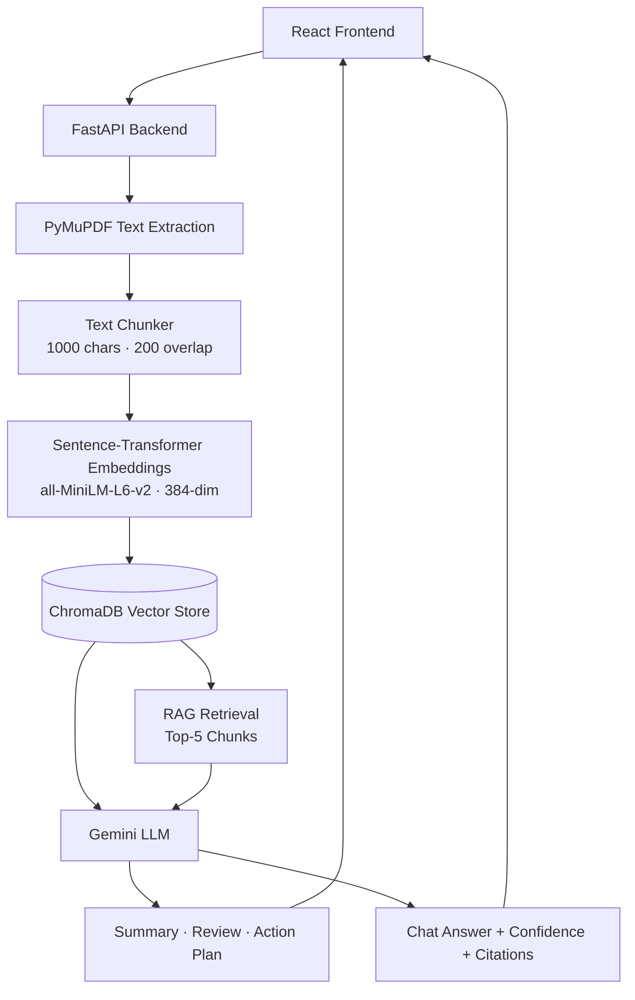
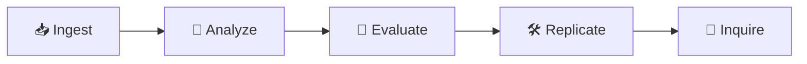

<div align="center">

<br/>
[](https://git.io/typing-svg)
 
<br/>


 


 
</div>
---
 
## 🧠 About The Project
 
**ResearchPilot** is a full-stack, citation-grounded AI research workspace. Instead of skimming a paper for hours or trusting a chatbot that quietly hallucinates statistics, you upload a PDF and get a structured, verifiable workspace: summary, critical review, replication roadmap, and a RAG chat — every claim traceable back to the exact source chunk it came from.
 
### 🎯 The Problem
 
Academic research workflows are fragmented and slow:
 
- 📚 **Information overload** — thousands of long papers, no fast way to filter them
- 🐢 **Manual review takes weeks** — synthesizing methodology and extraction plans by hand
- 🤥 **Weak AI grounding** — standard ChatGPT wrappers hallucinate metrics with no citation bounds
- 🧩 **Disconnected tools** — reading, planning, and chatting with a paper happen in five different apps
### 💡 Who It's For
 
- 🎓 Students and researchers who need to process papers fast, without losing rigor
- 🧑‍🔬 Anyone trying to replicate or extend published methodology
- 👩‍💻 Developers exploring **RAG + vector search + multi-stage LLM pipelines** in a real project
---
 
## 📸 Project Preview
 
| Dashboard | Analyze |
|:---:|:---:|
|  |  |
 
| Review | Action Plan |
|:---:|:---:|
|  |  |
 
| Chat with Citations |
|:---:|
|  |
 
---
 
## 🏗️ Architecture
 

 
---
 
## 🔍 Research Workflow
 

 
Every paper moves through the natural path of scientific inquiry — **Ingest → Analyze → Evaluate → Replicate → Inquire** — with citation chips linking every AI claim back to its source fragment in the References panel.
 
---
 
## 📂 Folder Structure
 
```
ResearchPilot/
├── backend/
│   ├── app/
│   │   ├── api/          # upload.py, analysis.py, review.py, action.py, chat.py, papers.py
│   │   ├── db/            # chroma_client.py, vector_store.py, metadata_store.py
│   │   ├── models/        # schemas.py
│   │   ├── services/      # pdf_processor.py, text_chunker.py, embedding_service.py, rag_engine.py
│   │   └── main.py
│   ├── requirements.txt
│   └── .env.example
│
├── frontend/
│   ├── src/
│   │   ├── components/layout/    # Sidebar.jsx, Topbar.jsx, AppShell.jsx
│   │   ├── features/
│   │   │   ├── dashboard/
│   │   │   ├── upload/
│   │   │   └── workspace/        # AnalyzePage, ReviewPage, ActionPlanPage, ChatPage
│   │   ├── lib/                  # api.js, hooks.js, routes.js
│   │   └── routes/AppRoutes.jsx
│   ├── package.json
│   └── vite.config.js
│
├── screenshots/
└── README.md
```
 
---
 
## ⚙️ Installation
 
### 1. Clone the repository
```bash
git clone https://github.com/Aditya2007raj/ResearchPilot-AI.git
cd ResearchPilot-AI
```
 
### 2. Backend Setup
```bash
cd backend
python -m venv venv
venv\Scripts\activate      # Windows
source venv/bin/activate   # macOS/Linux
 
pip install -r requirements.txt
```
 
### 3. Configure Environment
```bash
cp .env.example .env
# Add your GEMINI_API_KEY
```
 
### 4. Run Backend
```bash
uvicorn app.main:app --reload
```
 
### 5. Frontend Setup
```bash
cd ../frontend
npm install
npm run dev
```
 
---
 
## 🔑 Environment Variables
 
| Variable | Description |
|---|---|
| `GEMINI_API_KEY` | Google Gemini API key powering analysis, review, and chat |
 
---
 
## 🔌 API Endpoints
 
### Ingestion & Library
| Method | Endpoint | Description |
|---|---|---|
| POST | `/api/v1/upload/pdf` | Upload and process a PDF |
| GET | `/api/v1/papers` | List all papers |
| GET | `/api/v1/papers/stats` | Dashboard statistics |
 
### Analysis
| Method | Endpoint | Description |
|---|---|---|
| GET | `/api/v1/analysis/{file_id}/summary` | Problem, method, results, limitations, future work |
| GET | `/api/v1/analysis/{file_id}/review` | Quality scores, strengths, weaknesses |
| GET | `/api/v1/analysis/{file_id}/action-plan` | Skills, learning path, project extensions |
 
### Chat
| Method | Endpoint | Description |
|---|---|---|
| POST | `/api/v1/chat/{file_id}` | Ask a question, get a grounded answer + confidence + sources |
 
---
 
## 🛠️ Tech Stack
 
<table align="center">
<tr>
<td valign="top" width="25%">
**Frontend**
- React.js
- Vite
- Tailwind CSS
- Framer Motion
- Lucide React
</td>
<td valign="top" width="25%">
**Backend**
- FastAPI
- Pydantic
- SQLite
</td>
<td valign="top" width="25%">
**AI Layer**
- Google Gemini
- Sentence-Transformers
- RAG Pipeline
</td>
<td valign="top" width="25%">
**Vector Search**
- ChromaDB
- PyMuPDF
- Cosine Similarity Scoring
</td>
</tr>
</table>
---
 
## ✨ Features
 
| | | |
|---|---|---|
| 📤 Drag-and-Drop Ingestion | 🧠 AI Summarization | 📊 Live Dashboard Stats |
| 🔍 Critical Quality Review | 🗺️ Replication Action Plan | 💬 RAG Chat with Citations |
| 📎 Clickable Source References | 🎯 Confidence Scoring | 🧩 Progressive Disclosure UI |
| 🌙 Academic Dark Theme | ⚡ FastAPI Backend | 🧱 Clean Modular Architecture |
 
---
 
## 📌 Current Status
 
**✅ Completed**
- Drag-and-drop ingestion with progress pipeline and file validation
- SQLite metadata store with schema migrations
- Workspace shell with collapsible References panel
- Interactive Analyze accordion views
- Critical Quality Review scoring
- Action Plan replication tracker
- RAG chat with similarity-based confidence and citation binding
- Dashboard with live library statistics
**⚠️ Known Limitations**
- RAG retrieval is scoped to the active document only — cross-document corpus search is not yet implemented
---
 
## 🗺️ Roadmap
 
- [ ] 🔗 Cross-document corpus search
- [ ] 📄 Export analysis to PDF/Markdown
- [ ] 👥 Multi-user collaborative workspaces
- [ ] 🕸️ Citation graph visualization across a paper library
- [ ] 🔌 Support for additional LLM providers
- [ ] 🐳 Docker deployment
- [ ] 🔁 CI/CD pipeline
---
 
## 📈 GitHub Stats
 
<div align="center">


 
</div>
---
 
## 🤝 Contributing
 
1. Fork the repository
2. Create a branch: `git checkout -b feature/AmazingFeature`
3. Commit changes: `git commit -m 'Add AmazingFeature'`
4. Push: `git push origin feature/AmazingFeature`
5. Open a Pull Request
---
 
## 📄 License
 
Distributed under the **MIT License**. See `LICENSE` for details.
 
---
 
## 📬 Contact
 
<div align="center">
[](https://github.com/Aditya2007raj)
[](https://www.linkedin.com/in/aditya-raj-7a506a333/)
[](mailto:aadiraj2007singh@gmail.com)
 
</div>
---
 
## ⭐ Support
 
If this project helped you, consider:
 
- ⭐ **Starring** the repo
- 🍴 **Forking** it
- 🐛 **Reporting issues**
- 🤝 **Contributing**
---
 
<div align="center">

Made with 🧠 by **Aditya Raj Singh Shekhawat**
 
</div>
